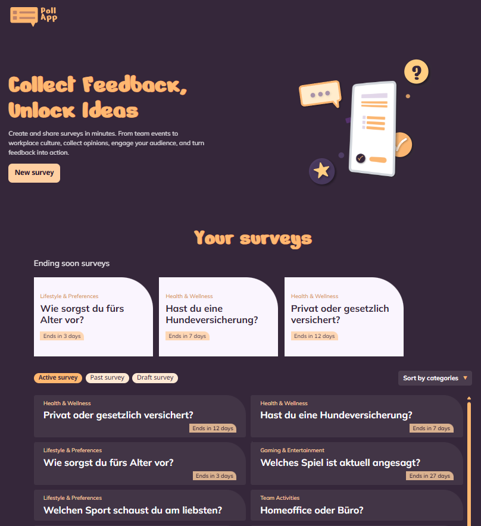
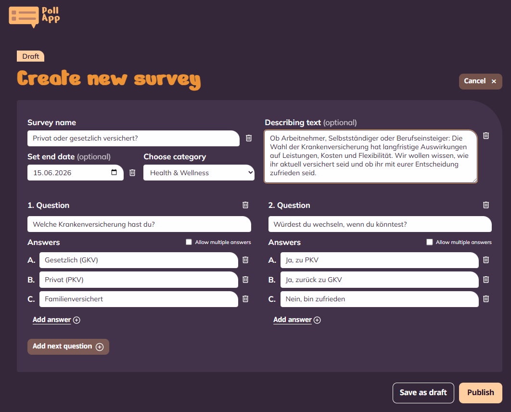
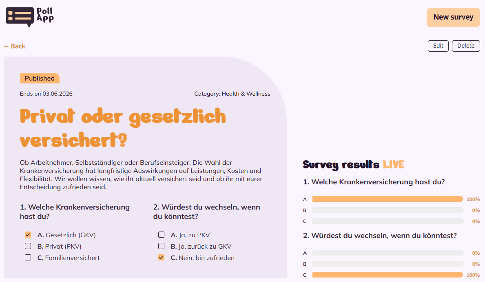

# Poll App


A survey platform built with Angular and Supabase — create polls, collect votes and see live results.

## 💡 What is this?

I built Poll App to practice full-stack development with Angular and Supabase. The idea was simple: a platform where you can create surveys on any topic, share them, and instantly see how people vote. Whether it's a quick team decision, a workplace question or just something you're curious about — you create the survey, others vote, and the results update live on screen.

Surveys can be saved as drafts first, published when ready, edited afterwards and filtered by category. The whole thing is connected to a real Postgres database with realtime subscriptions, so results appear without reloading the page.

## 📸 Screenshots





## 🧠 Features

✅ Create multi-question surveys with up to 6 answer options  
✅ Single and multiple choice configurable per question  
✅ Live results updating in real time via Supabase Realtime  
✅ Draft mode to save and revisit surveys before publishing  
✅ Edit surveys including questions, answers, category and end date  
✅ Active, Past and Draft tabs to keep surveys organized  
✅ Ending soon carousel on the home page  
✅ Category filter with dropdown  
✅ Fully responsive, tested on mobile and desktop  
✅ 404 fallback page  

## 🖥️ Tech Stack

| Layer | Technology |
|---|---|
| Framework | Angular 19 (Standalone Components) |
| Language | TypeScript 5 (strict mode) |
| Styling | SCSS with CSS Custom Properties |
| Backend | Supabase (PostgreSQL + Realtime) |
| State | Angular Signals |
| Forms | Reactive Forms |
| Routing | Angular Router |

## 🚀 Setup

```bash
git clone https://github.com/weskakay/poll-app.git
cd poll-app
npm install
ng serve        # Dev server → http://localhost:4200
ng build        # Production build
npx tsc --noEmit  # TypeScript check
```

Create `src/environments/environment.ts` with your Supabase credentials:

```ts
export const environment = {
  supabaseUrl: 'YOUR_SUPABASE_URL',
  supabaseKey: 'YOUR_SUPABASE_ANON_KEY',
};
```

## 📁 Project Structure

```
src/
├── app/
│   ├── components/
│   │   ├── home/           # Landing page with survey list and carousel
│   │   ├── create-survey/  # Form to create a new survey
│   │   ├── edit-survey/    # Form to edit an existing survey
│   │   ├── poll-detail/    # Survey detail with voting and live results
│   │   ├── poll-card/      # Reusable survey card component
│   │   ├── poll-results/   # Results bar chart component
│   │   └── not-found/      # 404 page
│   ├── services/
│   │   ├── poll.service.ts      # CRUD + Realtime + optimistic updates
│   │   └── supabase.service.ts  # Supabase client singleton
│   └── interfaces/
│       └── poll.interface.ts    # TypeScript interfaces and types
└── styles.scss                  # Global design tokens
```

## 🎨 Design

UI based on a custom Figma design. All colors, spacings, radii and fonts are defined as CSS Custom Properties in `styles.scss` and applied via `var(--token)` throughout the app — no hardcoded values.
